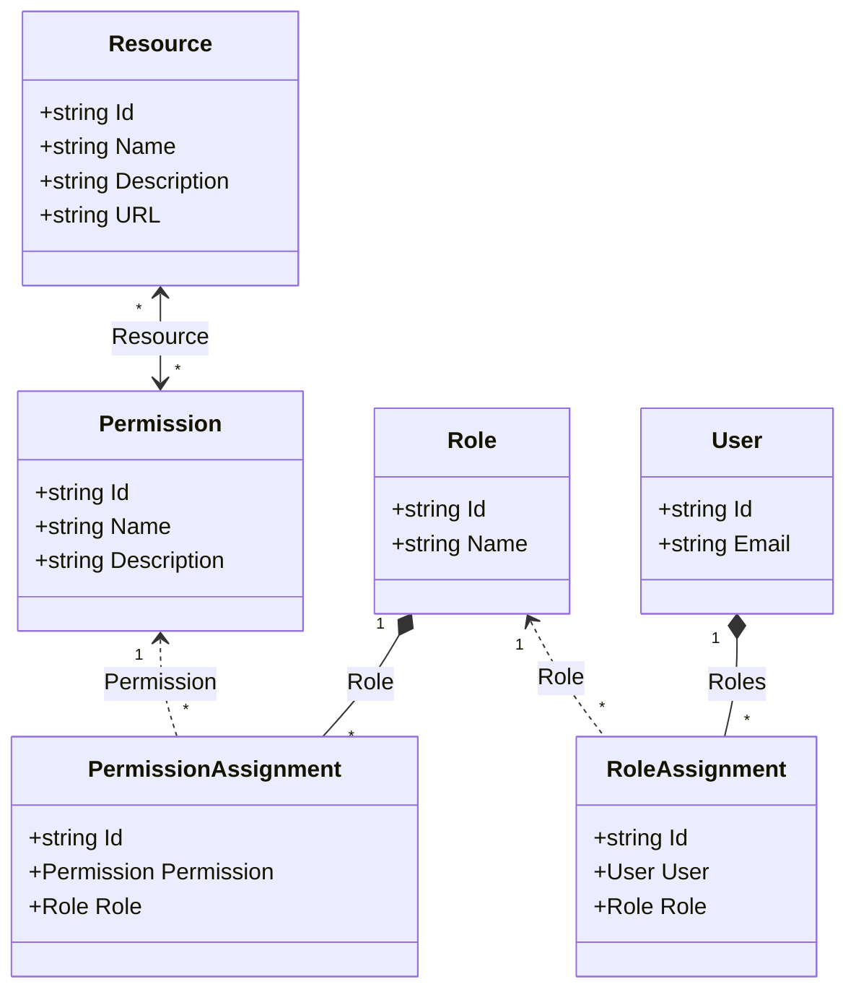

## Security model
Following diagram depicts model entities and relationships.

### Resource
Entity requiring authenticated access.
### Permission
Unit of access for individual entities of a resource. Used to define fine-grained approval to use resource.
### Role
Collection of permissions, defined by common business or technical requirements.
### User
Entity representing system client. Can be assigned roles.
