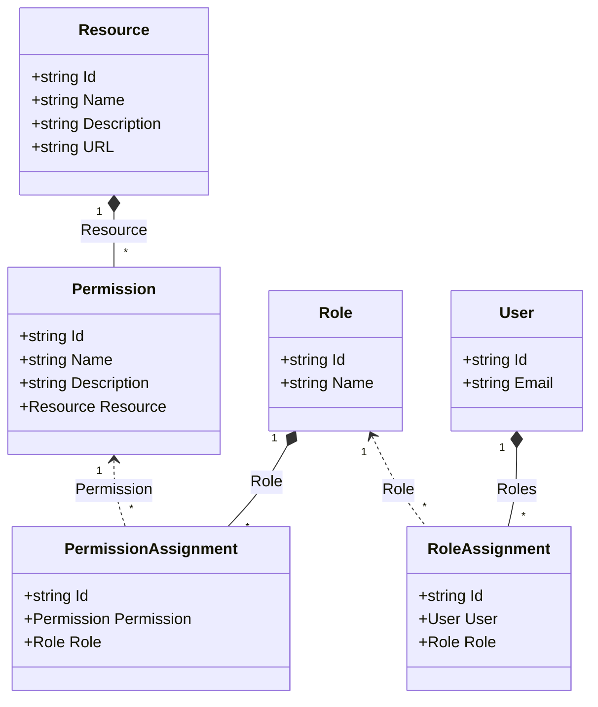

```mermaid
classDiagram
    class Permission {
        +string Id
        +string Name
        +string Description
        +Resource Resource
    }
    Resource "1" *-- "*" Permission: Resource
    Permission "1" <.. "*" PermissionAssignment: Permission
    class Role {
        +string Id
        +string Name        
    }
    class PermissionAssignment {
        +string Id
        +Permission Permission
        +Role Role
    }
    Role "1" *-- "*" PermissionAssignment: Role
    Role "1" <.. "*" RoleAssignment: Role
    class User {
        +string Id
        +string Email
    }
    User "1" *-- "*" RoleAssignment: Roles
    class Resource {
        +string Id
        +string Name
        +string Description
        +string URL
    }    
    class RoleAssignment {
        +string Id
        +User User
        +Role Role
    }
```
