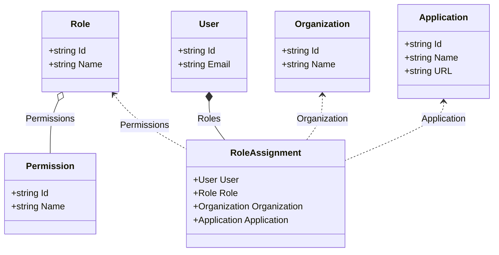

```mermaid
classDiagram
    class Permission {
        +string Id
        +string Name
    }
    class Role {
        +string Id
        +string Name
    }
    Role o-- Permission: Permissions
    Role <.. RoleAssignment: Permissions
    class User {
        +string Id
        +string Email
    }
    User *-- RoleAssignment: Roles
    class Organization {
        +string Id
        +string Name
    }
    Organization <.. RoleAssignment: Organization    
    class Application {
        +string Id
        +string Name
        +string URL
    }
    Application <.. RoleAssignment: Application    
    class RoleAssignment {
        +User User
        +Role Role
        +Organization Organization
        +Application Application
    }
```
