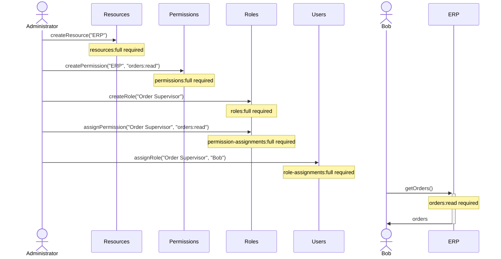
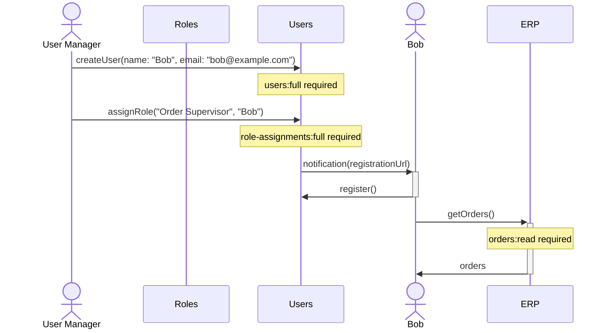

## Use Cases

1. New resource setup, consisting of creating resource, adding permissions, creating and assigning role. In the example, **ERP** resource provides customer orders, which can be access using **orders:read** permission. We would like to create an **Order Supervisor** role, which would have said permission, and assign it to existing user **Bob**.

2. Onboarding of a new user by a manager. As a **User Manager**, I should be allowed to create new user **Bob** and assign him an **Order Supervisor** role. A notification of account creation would be sent to **Bob** via email, allowing him to complete registration. Once completed, he is able to access **ERP** resource orders.

